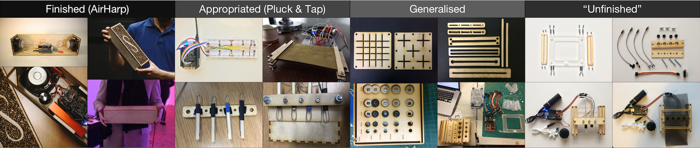
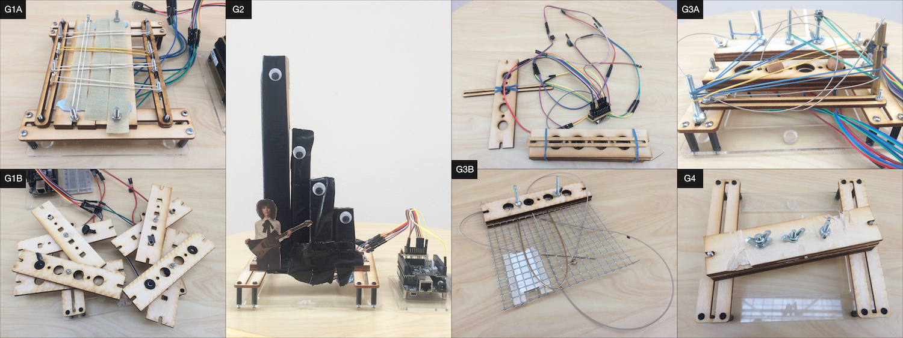
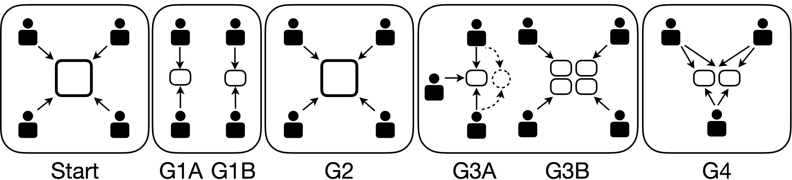

# Crafting Digital Musical Instruments: An Exploratory Workshop Study

Abstract
--------

In digital musical instrument design, different tools and methods offer
a variety of approaches for constraining the exploration of musical
gestures and sounds. Toolkits made of modular components usefully
constrain exploration towards simple, quick and functional combinations,
and methods such as sketching and model-making alternatively allow
imagination and narrative to guide exploration. In this work we sought
to investigate a context where these approaches to exploration were
combined. We designed a craft workshop for 20 musical instrument
designers, where groups were given the same partly-finished instrument
to craft for one hour with raw materials, and though the task was open
ended, they were prompted to focus on subtle details that might
distinguish their instruments. Despite the prompt the groups diverged
dramatically in intent and style, and generated gestural language
rapidly and flexibly. By the end, each group had developed a distinctive
approach to constraint, exploratory style, collaboration and
interpretation of the instrument and workshop materials. We reflect on
this outcome to discuss advantages and disadvantages to integrating
digital musical instrument design tools and methods, and how to further
investigate and extend this approach.

Introduction
============

Magnusson (Magnusson 2009) emphasises the pronounced epistemic dimension
of digital instruments when compared to acoustic ones; digital
instruments are created top-down through prior absorption of a
technical, symbolic body of knowledge, after which an explicit
implementation is designed. In contrast, they describe acoustic
instrument creation as being tied to bottom-up processes; acoustic and
mechanical properties of materials are explored experientially leading
to their configuration into instruments. With acoustic materials,
Magnusson describes, “the sound generation (and the required knowledge
of it) is given to us for free by nature” (Magnusson 2010).

Acknowledging the benefits of this direct relationship with material,
many digital instruments and design tools aim to give designers and
players a comparable freedom to explore. Many examples of this exist,
such as in modular synthesis where notionally symbolic circuits are
explored as hands-on material (Flood 2016). Software arts practitioners
and tool makers have emphasised the importance of materiality and craft
in exploring code (Bertelsen, Breinbjerg, and Pold 2009; Lindell 2014).
Innovative works in e-textiles (Stewart, Skach, and Bin 2018) and paper
electronics (Qi, Demir, and Paradiso 2017) integrate functionality
directly into materials, inviting new ways to explore function and form.
An altogether different exploratory experience is provided by instrument
design methods employing sketching, fiction and imagination (Andersen
and Gibson 2017; Monache and Rocchesso 2016).

Inspired by these various approaches, we were motivated to investigate a
context where the constraints of a toolkit (Magnusson 2010) and the
openness of craft-inspired (Kettley 2012) model-making coincide. We
created a workshop where groups of participants used crafting materials
to modify a kit-based digital musical instrument prototype that we
described as “unfinished” to encourage exploration. In this work we seek
to interpret the responses and outcomes to gain insight into the impact
of combining different styles of constraints, and to understand how
different materials affect exploratory process in digital musical
instrument design.

The next section of this paper contrasts different approaches to
supporting exploration in digital musical instrument design.
Subsequently the workshop design is detailed, and the outcomes are
reported on and discussed. We conclude by reflecting on their possible
consequences for combining instrument design tools and methods.

Background
==========

Comparing across toolkits and methods
-------------------------------------

Digital instrument design toolkits are useful design aids that abstract
implementation details into modular parts whose combination can be
rapidly explored. Toolkits reflect specific musical cultures and
knowledges (Magnusson 2009) such as instrument classification systems
(Calegario et al. 2017) and synthesis approaches, which through
abstraction gain extra flexibility allowing for novel recombinations.
One disadvantage of toolkits is that the original material qualities of
the parts are no longer present; a tangible media token of cardboard,
plastic or wallpaper will still perform the same function (Preston et
al. 2017). Another disadvantage is that in reifying familiar bodies of
knowledge, they make bottom-up exploration outside of those boundaries
difficult at the expense of artistic appropriation (Dix 2007; Hornecker
2012). While evidence suggests that expert toolkit users overcome the
toolkit’s influence (Bertelsen, Breinbjerg, and Pold 2009), for
beginners it is easy to mistake a toolkit’s perspective for the art and
craft itself (Mooney 2011).

Alternative approaches to toolkit-based design exploration aim to
provide different constraints. They propose that where design media
exerts less influence on which ideas are easy to represent, the designer
can instead explore personal expression and imagination (Perner-Wilson,
Buechley, and Satomi 2011). These approaches are often led by material
and conceptual interests, taking inspiration from craft principles
(Kettley 2012) and traditional design methods like sketching (Monache
and Rocchesso 2016) and fictional model-making (Andersen and Gibson
2017). Unlike with design toolkits, in these methods designers are
sometimes distanced from real interactions and behaviours as these
instead take on looser or imaginary forms. Ultimately, these differing
approaches to exploration could offer complimentary benefits to digital
luthiers.

Addressing diverse needs in digital lutherie {#questions}
--------------------------------------------

Digital luthiers are highly interdisciplinary practitioners who often
perform combined roles of inventor, maker and player (Jordà 2005;
Morreale and McPherson 2017). As designers they need to explore the
implementation, look and feel, and role of their designs as separate and
integrated issues (Houde and Hill 1997), typically as part of a
non-linear process (Goldschmidt 2014). In their process they need to not
only formulate and synthesise new ideas, but also take reified ideas and
prototypes and make them “malleable” (Andersen and Gibson 2017) through
decomposition and dissection (Murer, Fuchsberger, and Tscheligi 2017).

Recognising these diverse needs, we designed a workshop facilitating
exploration using both toolkit and craft-inspired approaches to
investigate the following questions:

-   How do participants explore in an environment featuring both a
    kit-based instrument and crafting materials?

-   How do they balance the material constraints against the constraints
    of their own ideas?

-   How do they develop musical gestures?

Workshop design
===============

A digital lutherie workshop focusing on craft practice was held during
NIME 2017. It was free and open to anyone registered for NIME, and no
submission was required. We expected but did not require participants to
be digital luthiers, and participants with experience in traditional or
acoustic instrument making or non-musical crafts were also welcome. The
organisers gave an introduction to the subject area, where they
introduced a theme of craft in NIME (Armitage, Morreale, and McPherson
2017) as a starting point for discussion. We devised a crafting activity
that would compliment discussions and reflection about craft in NIME,
and how it can be shared in the community.

The Unfinished Instrument
-------------------------

The goal of the activity was to facilitate open ended crafting of a
prototype instrument, that could appear to be “unfinished” and
subjectively reinterpreted. This process is illustrated in Figure
\[fig:designprocess\] and started with appropriating (Dix 2007) and
un-crafting (Murer, Fuchsberger, and Tscheligi 2017) an existing
instrument called the AirHarp[^1] developed by Chris Heinrichs in C++
using the Bela platform (McPherson and Zappi 2015), chosen for its
flexible synthesis of virtual string sounds using audio-rate sensor
inputs. Its physical model excited by an accelerometer was replaced with
up to eight low cost microphone capsules. This offered a high-bandwidth
connection between physical behaviour and sonic response, necessary for
facilitating gestural interaction using a wide variety of materials.

To provide a contrast to previous workshops and integrate with the
crafting materials, we focused on mechanical instead of software and
electronic modularity. Simple and repeatable prototypes were developed
using the microphone capsules, that would facilitate physical
modification via materials available from a craft modelling store. Two
gestural interactions were offered as demonstration: a plucking
configuration featuring wooden tines clamped across the microphone
cavity, and a tapping configuration which allowed different surface
materials to be clamped across all of the microphones to form a surface.

These two example configurations were then generalised in terms of their
physical structure, such that both could be made from the same basic
components. Introducing flexibility into the design required trial and
error to strike a balance between openness and robustness; for example
the microphones had to sit firmly in place but still be movable, and the
physical structure featured slots instead of holes where possible to
make it adjustable. The final design[^2] was presented to participants
along with its two pre-explored configurations (pluck and tap).

Crafting environment
--------------------

The room consisted of tables for small groups of 2-5 to sit around
facing each other. There was a long table at one side of the room
displaying a variety of tools and crafting materials. The organisers
presented the opening discussion from a projector at the front and
provided technical support around the room.

Materials were selected for their familiarity and tactile and acoustic
variety, and included rods of aluminium, brass, wood and plastic, sheets
of various foams and metal meshes, paper, corrugated card, thick card,
cork balls and granules, folding clips, and googley eyes. Tools included
scissors, wire cutters, jewellery pliers and cutters, adhesives, double
sided tape and foam tape, duct tape, blu tack, notepads, pens and
miniature cameras. Each group had at least one camera which they could
use to document their crafting (consent forms were signed for filming).
Tools and materials could be used in any quantity by any group at any
time.

Data collection
---------------

Immediately before and after the workshop, participants shared their
reflections on their own craft practice and their crafting experience.
Days after the workshop, reflections and feedback were gathered from
participants via in-person interviews and an online survey.

Outcomes
========

The workshop had 20 participants encompassing research, instrument
design, teaching, composing and performance. They were split into four
groups (G1-4) but were given no brief for how they should collaborate.
In this section, the groups’ crafting process and outcomes are
described. Participants’ reflections are then thematised based on the
questions in \[questions\]. An emergent theme of collaboration process
is also presented.

Overview of outcomes
--------------------

### Group 1

G1 split into two subgroups and worked with two separate instruments
(termed G1A and G1B).

**G1A:** *“It started out with the elastic bands in the way of it just
being easy to get a string effect on the string sound and do multiple
sensors at once. Then we started with duct tape and getting the sound of
pulling the tape off the other tape to get the kind of like \[ripping\]
sound which was really nice. And \[redacted\] suggested velcro which
kind of wound up in this way \[scrapes velcro\] where you can play it
like a plucked harp like thing. And then it’s also just really fun to
whip it \[with a giant foam stick\].”*

**G1B:** *“We just split different microphones onto separate layers so
you can play them. And it could be like a multiplayer sort of instrument
\[two players demonstrate\]. And we thought about developing different
materials for each layer to get different sounds. That’s pretty much
it.”*

### Group 2

G2’s instrument was demonstrated as two versions. The first was
described as a ‘feedback organ’ where cardboard tubes could be
telescopically lengthened to produce different timbres of feedback, with
each microphone isolated.

**G2:** *“One group member suggested something where we could throw
objects into it and they would rattle around. Then, we decided that the
tubes were cool, but would feel more like an instrument if they were
different lengths, even though that wasn’t necessarily functional.”*

The second was based on striking the cardboard tubes, and featured a
code modification affecting timbre.

**G2:** *“We changed the code in an attempt to make the instrument
slowly change octaves, but mis-judged the size of the buffer so we
created an extremely fast arpeggiator (like 8-bit video game polyphony)
instead, which turned out to give our instrument a unique sound.”*

### Group 3

G3 split into two subgroups working with two separate instruments (G3A
and G3B).

**G3A:** *“We tried to figure out the different parameters of the mass
damping but we sort of got slightly lost and got some help to reboot the
project. With 30 seconds left we switched to the pluck model so all it
does is just do the original pluck thing. So musically it’s very
uninteresting \[...\] But what we’ve got is this nice little visual
representation of the evolution of the instrument.”*

G3B separated their instrument into four sub-instruments, three of which
were demonstrated.

**G3B:** *“We tried to extend each single microphone and explore a
single microphone, and I think as a whole it would have been \[the
idea\] to come together at the end. We explored different kinds of sound
aesthetics, trying to understand actually what those mics could do and
it was quite limited. In my case I’ve made this sandwich and inside it
there’s the microphone and some bolts, so if you shake it hard, then you
get some sound.”*

*“This \[second sub-instrument\] is even more basic, well you can do
this \[plucks string against mesh\] and \[scrapes mesh\]. I think the
acoustic sounds are more interesting than those coming from the
loudspeaker. One way to use this instrument would be to combine these
two sound sources.”*

*“Here’s one final rudimentary part \[third sub-instrument\]. It doubles
as a crucifix, it’s a tapping mechanism, you can slightly hear it if you
twist it around, that’s what I came up with.”*

### Group 4

**G4:** *“I guess at first we were frustrated with having limited notes,
so we tried a lot of things. Somehow the feedback seemed to be
inspirational and we started to come up with ways of thinking about the
whole animal. We added speaker rattles and we looked at ways to create
effects acoustically \[the group begin performing\]. This is the
subtractive synthesis bit \[microphone attached to a hacksaw\]. So the
same idea as \[G3B\] to mix the acoustic sound.”*

Exploring constraints and constraining exploration
--------------------------------------------------

Most participants said they intended to explore the instrument and
materials rather than start with a specific goal. This extended to
setting aside our suggestion about focusing on subtle details.

**G2:** *“Our intentions were quite geared towards the exploration side
anyway so that continued throughout.”*

**G4:** *“What was interesting was to discover an instrument and to
basically try to make music with it. So I would say even though maybe
the goal was not announced like that, we didn’t try at all like
theoretically thinking about how to improve this instrument \[...\] we
just tried to kind of okay we have this situation let’s try to make
music.”*

**G2:** *“I think we wanted to do something different from what the
other groups did. I don’t think we said that explicitly to each other,
though.”*

Where initial ideas were pursued, it sometimes turned out that the
design constraints were not supportive.

**G3:** *“We had this grand idea of having this sort of spring reverb
that was going to allow us to pluck it whilst these \[strings\] would
carry on vibrating and then the balls would continue that in a physical
way.”*

**G3:** *“The thing that I wanted to achieve is to get away from this
pluck stuff and this was my only idea \[pulling string through mesh\].”*

While the initial conditions of the instrument did not thrill, and the
option to modify the code was there, participants still mostly preferred
to continue exploring.

**G1:** *“I personally made a conscious decision that I was not going to
try to change the code that was running on the device because I didn’t
want to be in that headspace.”*

**G1:** *“Once you get into trying different things with it, you don’t
really think about that aspect of the instrument so much, which I think
is important. Because you can spend all this time tuning the sound, but
then you need to spend some time tuning interaction or exploring
interaction as well.”*

Once the participants became more familiar with the constraints, they
explored through a succession of making, playing and continuous
iteration.

**G1:** *“There was an aspect for me that is like it wasn’t so precious,
it wasn’t like a thing that I had built up in my head as being like, oh
I really want to try this specific thing.”*

**G1:** *“Coming into it not really having a clear goal or a clear
expectation made the exploration more fun and lighthearted, I think it’s
analogous to music making.”*

**G2:** *“We were free to really think about the physical interaction
and the visual details that would influence how the instrument was
played.”*

**G2:** *“We were all very quick to discard something if it didn’t look
right.”*

**G3:** *“\[It was\] more or less chaotic, which is a good thing if you
wish to expand the design space.”*

As this process developed over time, there were points of little verbal
discussion and instead a shared focus on doing.

**G4:** *“We specifically acted and we interacted in and not too much
discussion but like, oh you did that let me let me add that, or you did
that let me cut that.”*

**G2:** *“It’s kind of just like a feedback system just like idea
bouncing back and forth.”*

**G2:** *“It ended up being implemented through playing modes.”*

**G4:** *“I actually never experienced like those things, it was like
hmm so I’m doing as I’m experimenting as I’m in doing.”*

**G2:** *“It felt like it was very responsive; I am coming with one idea
and and we could just, yes try it out, oh no it doesn’t work, uh-huh
okay \[...\] It wasn’t any like darlings that you want to keep and very
like quick to come up with some new ideas when something wasn’t
working.”*

One participant in G4 reflected on the divergence away from the brief.

**G4:** *“Because everyone in the room was creative, it came to not at
all micro differences but huge differences even in the philosophy of
music making or instrument building and the results themselves. Actually
I loved many of the instruments that the other groups did and they were
super different.”*

Exploring sound, gesture and materials
--------------------------------------

In their initial explorations, groups tested out the behaviour of the
instrument, and in some cases these trials were dissatisfying or
unrewarding, but groups later returned to the same gestures.

**G3:** *“One of our first problems was that it was really quiet, so we
first of all tried to make a more directional cone so we could turn up
the gain without it feeding back. That wasn’t entirely successful.”*

**G2:** *“One group member suggested something where we could throw
objects into it and they would rattle around. We worked for a while
trying to make that work (cardboard tubes, plastic eggs, different
materials thrown in) but we didn’t have the right materials to get a
good bounce.”*

**G2:** *“In my head my ambition was more the acoustic sound \[...\] but
I didn’t think it through that it was actually destroying the sources
\[microphones\]. One of the other things that quickly annoyed me was how
responsive it felt \[...\] it sounds so the same every time \[...\] so
we went looking for more variation.”*

It was not long before the groups had accumulated differing collections
of materials at their tables. The open layout of the table seemed to
suggest ideas.

**G2:** *“It’s good to actually arrive there and have all this broad
range of material and to experience the freedom you know like the
creative freedom that it provides.”*

**G1:** *“It was interesting to have this is a kind of playground to
explore different kinds of tactility that was then serving as
inspiration for something totally different.”*

New gestures often resulted from the incidental combination of ideas,
and failed ideas resulted in raw materials being reused in new ones.

**G1:** *“\[G1 participant\] was interested started out with ripping
tape off and then that developed to the velcro, and then at first we
just tried to put the two side-by-side and then kind of by accident
realised that they complemented each other \[...\] like fret noise on a
guitar, there’s a bit of a lead up and then a more definite pluck
sound.”*

The process of combining and transforming materials and gestures were
compared to sketching and sculpture, and happened more rapidly as
materials accumulated on tables.

**G4:** *“I found the bass string and some metal and that give me like a
rough idea to try to sketch.”*

**G2:** *“\[The process\] became very much focused on the sculpture.”*

**G4:** *“At the end we were always kind of performing with it or trying
it to make sound that was really interesting.”*

Exploring collaborative process
-------------------------------

The groups diverged in their approach to collaboration (see Figure
\[fig:collaboration\]), and took advantage of the flexibility of the
instrument’s design to re-configure as their collaborative style
required.

**G1:** *“You specified to collaborate in groups but you didn’t really
go beyond that with the detail of how to collaborate, so it was really
nice to see how the different groups came out with very different ways
of working together. We kind of split it in half and made two
instruments between four people.”*

**G3B:** *“Initially because there was four of us working on it we tried
to extend each single microphone and each explore a single microphone,
and I think as a whole it would have been \[the idea\] to come together
at the end.”*

**G1:** *“The activity and the group environment was super inspiring, to
see what everyone else came up with from the same initial state.”*

**G2:** *“Sometimes we would each take a particular task \[...\] and
sometimes one of us would decide to experiment with a new idea while the
others worked on something else.”*

Across groups, ideas were shared explicitly and implicitly.

**G1:** *“Someone else actually pointed out that connection and then it
made it a little bit more usable.”*

**G2:** *“This kind of feedback idea was very collective idea so it
wasn’t one person’s.”*

**G2:** *“It was interesting because I never made an instrument in a
group process like that.”*

Discussion
==========

Exploring constraints and constraining exploration
--------------------------------------------------

The brief presented the workshop as an opportunity to reflect on subtle differences between outcomes given an identical starting point, however
this was mismatched with the unconstrained environment. Instead of
responding to this brief, most responded to what emerged from their
ideas and engaging with each other. Although this scripting of the
workshop was light and open responses were welcomed, it inadvertently
motivated playful subversion and appropriation. To engage with subtle
differences of craft, an alternative strategy could involve participants
presenting and comparing their own instruments that have similar
functions, forms or design processes.

The goal of un-crafting (Murer, Fuchsberger, and Tscheligi 2017) the
AirHarp into the Unfinished Instrument was to present something complete
in terms of synthesis and sensors, but open to interpretation in terms
of performance and gestures. While the instrument could only be
“re-crafted” so much in one hour, the instruments exhibited personality
and style, and they inspired collaboration and discussion. Some
participants wanted the code to be more accessible, and some were
generally dissatisfied with the resulting artifact itself but still saw
value in how it represented their group process. The shortcomings of the
instrument’s sound and sensors and the potential for its parts to be
recombined or reinterpreted, seemed to just about balance frustration
with motivation.

Exploring sound, gesture and materials
--------------------------------------

The workshop environment encouraged mixing a variety of approaches
including design, bricolage and performance. The layout of materials
across a long table inspired ideas through visual survey, and their
abundance and malleability led to their combination and destruction as
needed. Participants were aided by not being attached to materialised
ideas, perhaps due to the familiarity and low cost of the materials.
This contrasts with circuitry-based workshops where participants
interacted in a cautious and apprehensive manner (A. P. McPherson et al.
2016). The instrument parts were used and repurposed in surprising ways,
sometimes fictitious ones as in G2’s instrument. Some groups
distinguished between instrument parts and crafting materials, while
others blurred this line completely. After initial disappointment with
the instrument’s lack of responsiveness, participants discovered
stroking, hitting, scraping, throwing, twisting, pulling, pushing,
sawing, singing, shaking, whacking, dropping and more. The hands-on way
of working offered fast iteration of testing gestural ideas and sharing
and critiquing the results, to the extent that many ideas were explored
simultaneously. A notable pattern of activity across groups was the
curation of a portfolio of gestures, which were continuously refined as
new materials were incorporated into the instrument. When demonstrating
their instruments to each other at the end of the workshop, participants
were not required to perform however this was vital to some groups. The
outcomes indicate that“making the instrument malleable” (Andersen and
Gibson 2017) is not only applicable in fictional model-making scenarios.

Exploring collaborative process
-------------------------------

One of the more surprising aspects of the workshop was the diversity of
collaboration it afforded the participants, as depicted by Figure
\[fig:collaboration\]. Even the more experienced participants commented
that this workshop offered them a way of working that their current
practice and community does not. There were no apparent barriers to
dynamically configuring group organisation, roles and process, or any
notable friction between verbal and non-verbal communication, or overtly
performative or design-led activity. The workshop facilitated
participants to use their existing skills, experience and interests, or
simply respond to what emerged, without dividing labour in the group or
enforcing rigid role play. Exploring the design environment’s
affordances was a shared experience across groups, as observing an idea
contributed to one’s own understanding. Some ideas were felt to be
collectively owned such as feedback. The environment’s openness allowed
different collaborative styles to emerge.

Suggestions for further investigation
-------------------------------------

To provide deeper evaluation of this workshop method, we recommend a
comparative approach with other tools and methods. We perceive potential
in further integration of electronic and digital crafting materials and
methods such as e-textiles, paper electronics and live coding. Such
materials could not only be more pragmatic, but also more open and
inclusive in terms of subjective exploration (Stewart, Skach, and Bin
2018; Qi, Demir, and Paradiso 2017; Ogborn 2016). Since participants
seemed to curate collections of gestures in the workshop, amplifying
this behaviour with tools for rapid capture and comparison of gestural
ideas could also be a promising line of investigation.

Conclusion
==========

The process of exploring gesture in digital musical instrument design
involves a complex interplay between what an instrument can do versus
what its creators and players would ideally like it to do. Tools and
methods often address these issues through two styles of exploration;
toolkits encouraging exploration through constraining actual instrument
behaviour, and sketching and model-making encouraging exploration guided
by imagination. While independent exploration of these issues is
beneficial, we sought to investigate the potential of supporting
designers to explore them concurrently through a craft-inspired workshop
method. We found that reformulating an existing instrument to have a
modular mechanical structure and combining it with crafting materials
enabled rapid, open exploration of gesture. Groups also restructured the
instruments’ form to suit their gestural ideas, and the group setting of
the workshop fostered diverse collaborative process. Further
investigation is needed to identify how this method compares with those
that inspired it, and where in a larger scale design process it might be
appropriate and effective.

Acknowledgments
===============

Thanks to Chris Heinrichs for the original AirHarp design. Thanks to the
workshop participants for an inspiring session. Thanks to the additional
workshop organisers; Astrid Bin, Fabio Morreale, Robert Jack and Jacob
Harrison. Thanks for feedback on earlier versions of this work to Jason
Freeman, Arthur Carabott, Ezra Teboul, Avneesh Sarwate, Anna Xambo, Thor
Magnusson, Sarah Kettley and Flora Dennis. This research is supported by
EPSRC under grants EP/L01632X/1 (Centre for Doctoral Training in Media
and Arts Technology) and EP/N005112/1 (Design for Virtuosity).

References
==========

Andersen, Kristina, and Dan Gibson. 2017. “The Instrument as the Source
of New in New Music.” *Design Issues* 33 (3): 37–55.

Armitage, Jack, Fabio Morreale, and Andrew McPherson. 2017. “‘The Finer
the Musician, the Smaller the Details’: NIMEcraft Under the Microscope.”
In *Proc. NIME*.

Bertelsen, Olav W., Morten Breinbjerg, and Søren Pold. 2009. “Emerging
Materiality: Reflections on Creative Use of Software in Electronic Music
Composition.” *Leonardo* 42 (3): 197–202.

Calegario, F., M. M. Wanderley, S. Huot, G. Cabral, and G. Ramalho.
2017. “A Method and Toolkit for Digital Musical Instruments: Generating
Ideas and Prototypes.” *IEEE MultiMedia* 24 (1): 63–71.
doi:[10.1109/MMUL.2017.18](https://doi.org/10.1109/MMUL.2017.18).

Dix, Alan. 2007. “Designing for Appropriation.” In *Proceedings of the
21st British HCI Group Annual Conference on People and Computers: HCI...
but Not as We Know It-Volume 2*.

Flood, Lauren. 2016. “Building and Becoming: DIY Music Technology in New
York and Berlin.” PhD thesis, Columbia University.

Goldschmidt, Gabriela. 2014. *Linkography: Unfolding the Design
Process*. MIT Press.
<https://books.google.com/books?hl=en&lr=&id=jXEbAwAAQBAJ&oi=fnd&pg=PR7&ots=4Z1Wb5qSdF&sig=fCK9jcSMmMCyWSpLm0qi1CktFpY>.

Hornecker, Eva. 2012. “Beyond Affordance: Tangibles’ Hybrid Nature.” In
*Proceedings of the Sixth International Conference on Tangible, Embedded
and Embodied Interaction*, 175–82. ACM.

Houde, Stephanie, and Charles Hill. 1997. “What Do Prototypes
Prototype.” *Handbook of Human-Computer Interaction* 2: 367–81.
<https://books.google.co.uk/books?hl=en&lr=&id=WuQbERgXR10C&oi=fnd&pg=PA367&dq=What+do+Prototypes+Prototype%3F&ots=--zBlHTFmT&sig=1OL0wqeXTFR0OI6EAZ6yFfY8eQo>.

Jordà, Sergi. 2005. “Digital Lutherie: Crafting Musical Computers for
New Musics’ Performance and Improvisation.” PhD thesis, Universitat
Pompeu Fabra. <http://mtg.upf.edu/node/449>.

Kettley, Sarah. 2012. “The Foundations of Craft: A Suggested Protocol
for Introducing Craft to Other Disciplines.” *Craft Research* 3 (1):
33–51.
<http://www.ingentaconnect.com/content/intellect/CRRE/2012/00000003/00000001/art00003>.

Lindell, Rikard. 2014. “Crafting Interaction: The Epistemology of Modern
Programming.” *Personal and Ubiquitous Computing* 18 (3): 613–24.
<http://link.springer.com/article/10.1007/s00779-013-0687-6>.

Magnusson, Thor. 2009. “Of Epistemic Tools: Musical Instruments as
Cognitive Extensions.” *Organised Sound* 14 (02): 168–76.
<http://journals.cambridge.org/abstract_S1355771809000272>.

———. 2010. “Designing Constraints: Composing and Performing with Digital
Musical Systems.” *Computer Music Journal* 34 (4): 62–73.
<http://www.mitpressjournals.org/doi/pdf/10.1162/COMJ_a_00026>.

McPherson, Andrew P., Alan Chamberlain, Adrian Hazzard, Sean McGrath,
and Steve Benford. 2016. “Designing for Exploratory Play with a Hackable
Digital Musical Instrument.” In *Proceedings of the ACM Conference on
Designing Interactive Systems*. ACM.

McPherson, Andrew, and Victor Zappi. 2015. “An Environment for
Submillisecond-Latency Audio and Sensor Processing on BeagleBone Black.”
In *Audio Engineering Society Convention 138*.
<http://www.aes.org/e-lib/browse.cfm?elib=17755>.

Monache, Stefano Delle, and Davide Rocchesso. 2016. “Cooperative Sound
Design: A Protocol Analysis.” In *Proceedings of the Audio Mostly 2016*,
154–61. AM ’16. New York, NY, USA: ACM.
doi:[10.1145/2986416.2986424](https://doi.org/10.1145/2986416.2986424).

Mooney, James. 2011. “Frameworks and Affordances: Understanding the
Tools of Music-Making.” *Journal of Music, Technology and Education* 3
(2): 141–54.

Morreale, Fabio, and Andrew McPherson. 2017. “Design for Longevity:
Ongoing Use of Instruments from Nime 2010-14.” In *Proc. Nime*, 192–97.

Murer, Martin, Verena Fuchsberger, and Manfred Tscheligi. 2017.
“Un-Crafting: De-Constructive Engagements with Interactive Artifacts.”
In *Proceedings of the Tenth International Conference on Tangible,
Embedded, and Embodied Interaction*.

Ogborn, David. 2016. “Live Coding Together: Three Potentials of
Collective Live Coding.” *Journal of Music, Technology and Education* 9
(1): 17–31.

Perner-Wilson, Hannah, Leah Buechley, and Mika Satomi. 2011.
“Handcrafting Textile Interfaces from a Kit-of-No-Parts.” In
*Proceedings of the Fifth International Conference on Tangible,
Embedded, and Embodied Interaction*, 61–68. ACM.

Preston, William, Steve Benford, Emily-Clare Thorn, Boriana Koleva,
Stefan Rennick-Egglestone, Richard Mortier, Anthony Quinn, John Stell,
and Michael Worboys. 2017. “Enabling Hand-Crafted Visual Markers at
Scale.” In *Proceedings of the 2017 Conference on Designing Interactive
Systems*, 1227–37. ACM.

Qi, Jie, Asli Demir, and Joseph A. Paradiso. 2017. “Code Collage:
Tangible Programming on Paper with Circuit Stickers.” In *Proceedings of
the 2017 CHI Conference Extended Abstracts on Human Factors in Computing
Systems*, 1970–7. ACM.

Stewart, Rebecca, Sophie Skach, and Astrid Bin. 2018. “Making Grooves
with Needles: Using E-Textiles to Encourage Gender Diversity in Embedded
Audio Systems Design.” In *DIS ’18: Designing Interactive Systems
Conference 2018*, 10. Hong Kong: ACM.

[^1]: Search AirHarp in http://github.com/bela/belaplatform

[^2]: http://bit.ly/theunfinishedinstrument
